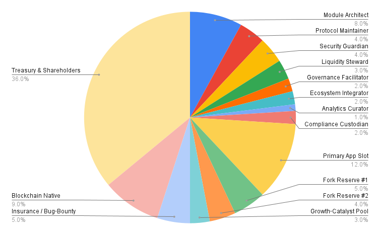

# RVNWL — Revamp Protocol with Shareholding

A decentralized, open-source smart contract protocol for recycling illiquid tokens into native blockchain currency, powered by an immutable, shareholding revenue model. No speculation, no admin keys—just algorithmic, on-chain liquidity restoration.

---

## ✨ What is RVNWL / Revamp Protocol?

RVNWL is the first protocol to **recycle** illiquid tokens into native blockchain currency at premium, preset rates—transforming stagnant capital into instant, transparent liquidity.

- **Immutable smart contracts** — No admin keys, no backdoors.
- **Shareholding Pool** — 100 fixed shares, never leaving the contract, earning revenue from every listing, delisting, pool join, and revamp order.
- **Open Listing** — Anyone can list any supported asset and set its revamp rate.
- **No Hype, No Persuasion** — Outcomes are code-driven and on-chain. Participation is voluntary; rewards depend on ongoing network activity.

> **Proof-of-Concept UI:**  
> 👉 [rvnwl.com](https://rvnwl.com)

---

### Initial Shareholding Distribution

The initial deployment assigns protocol shares across defined roles and reserves to ensure sustainability, security, and adaptability:

| Role / Pool                | Shares (%) | Ethereum Address      |
|----------------------------|------------|----------------------|
| Module Architect           | 8          | 0x3AcBF...ab251f     |
| Protocol Maintainer        | 4          | 0xD185d...38515D     |
| Security Guardian          | 4          | 0xA792D...8DE384     |
| Liquidity Steward          | 3          | 0x9B0F6...92f8Fd0    |
| Governance Facilitator     | 2          | 0x23F50...D4EE6      |
| Ecosystem Integrator       | 2          | 0xd89d1...40836F     |
| Analytics Curator          | 1          | 0x1E189...7F04B3     |
| Compliance Custodian       | 2          | 0x284c0...F8A69E     |
| Primary App Slot           | 12         | 0xA2652...de63A      |
| Fork Reserve #1            | 5          | 0xEfe1f...5Ec28      |
| Fork Reserve #2            | 4          | 0xec30C...50AFF3     |
| Growth-Catalyst Pool       | 3          | 0x7F025...E59dbc     |
| Insurance / Bug-Bounty     | 5          | 0xBa479...5fEfC7     |
| Blockchain Native          | 9          | 0x63C20...4eDa3B     |
| Treasury & Shareholders    | 36         | 0x14b32...896a10     |

> **Note:** Each address represents a dedicated protocol role, functional budget, or governance pool, as defined in the contract at deployment. These assignments are immutable and on-chain.

---

## 💡 Key Features

- **Burn-to-Reclaim:** Permanently removes illiquid tokens from circulation in exchange for native currency.
- **Algorithmic Revenue Sharing:** All protocol fees and native currency inflows are proportionally distributed to the 100-share pool.
- **DAO-Ready:** Designed for community governance and extension.
- **Open Integration:** Plug-and-play for wallets, dashboards, DAO portals, and new assets.

---

## 🚀 Quickstart

### 1. Deploying Smart Contracts

#### Using Hardhat (Local Testnet)

bash
cd contracts
npm install
npx hardhat test      # Run unit tests

#### To deploy locally
npx hardhat node      # Start local network
npx hardhat run scripts/deploy.js --network localhost

#### Using Remix IDE (Browser-Based)
1. Go to [Remix IDE](https://remix.ethereum.org/)

2. Import the contracts from the /contracts directory (upload or use GitHub import).

3. Compile contracts in the Solidity Compiler tab.

4. Deploy and interact via the Deploy & Run Transactions tab.

5. Set environment/network as appropriate (Injected Web3 for testnet/mainnet).

**Tip:** Remix is recommended for direct, visual deployments and on-chain interaction.

### 2. Frontend (React App)
cd frontend

npm install

npm start

Visit http://localhost:3000 to interact with your local frontend.

## 🧑‍💻 **Project Structure**

/contracts         # Solidity smart contracts

/frontend          # React frontend (src/pages/components)

  └─ src/abis      # Contract ABIs

/docs              # (Optional) Protocol and API docs

/scripts           # Automation, deployment scripts

---

## 🌐 **Resources**

Website / PoC UI: [rvnwl.com](https://rvnwl.com/revamp)

Docs / GitBook: [modulexo.gitbook.io](https://modulexo.gitbook.io)

Discord: [RVNWL] (https://discord.com/invite/VsSXFsMd)

Telegram: [rvnwlofficial] (https://t.me/rvnwlofficial)

GitHub: [github.com/rvnwl/protocol](https://github.com/modulexo/revamp)

## 🤝 **Contributing**

Contributions, audits, and forks are welcome!
See CONTRIBUTING.md and CODE_OF_CONDUCT.md for details.

## ⚠️ **Disclaimer**

This protocol is provided as-is, with no warranties or guarantees. All smart contract interactions are irreversible once mined. Use at your own risk. See LICENSE for full terms.

## 🏷️ **Topics**

blockchain defi smart-contracts ethereum polygon open-source revamp recycle liquidity recycling native-currency onchain-token-burn supply-cleanup shareholding governance dao protocol transparency composable-solutions immutable trustless