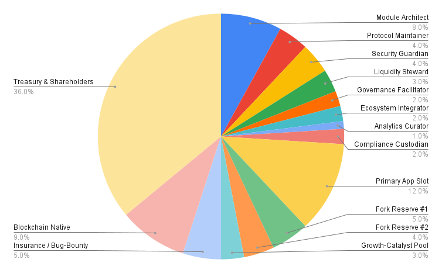

# RVNWL / Revamp Protocol – Architecture Overview

## Overview

RVNWL’s architecture is designed for maximal modularity, transparency, and on-chain sustainability. The protocol consists of two primary smart contracts—**Revamp** and **ShareHolding**—deployed immutably and intended for seamless integration with multiple independent frontends.

### Key Components

#### 1. Revamp Contract (`Revamp.sol`)
- **Purpose:** Handles the recycling (“revamp”) of illiquid tokens into native blockchain currency.
- **Features:**
  - **Asset Listing & Delisting:** Anyone can list new assets at a custom revamp rate (premium) for native currency; delisting is permissionless, incurring a protocol fee.
  - **Deposit & Burn:** Users deposit both the listed asset and matching native currency. The asset is burned (irreversibly removed from circulation); the native currency is distributed among active pool participants.
  - **Rate Enforcement:** Revamp rates are set by the lister and enforced by the smart contract at every join.

#### 2. ShareHolding Contract (`ShareHolding.sol`)
- **Purpose:** Manages on-chain shareholding and proportional distribution of protocol revenue.
- **Features:**
  - **Fixed 100-Share Pool:** Ownership never leaves the contract; shares can only be joined or exited through contract logic.
  - **Revenue Distribution:** All listing/delisting fees, and all revamp activity, are allocated directly to current shareholders in real time.
  - **Non-Transferrable Shares:** Participation is strictly contract-governed; no off-chain admin, no token trading.

### Initial Shareholding Distribution

The initial deployment assigns protocol shares across defined roles and reserves to ensure sustainability, security, and adaptability:

| Role / Pool                | Shares (%) | Ethereum Address      |
|----------------------------|------------|----------------------|
| Module Architect           | 8          | 0x3AcBF...ab251f     |
| Protocol Maintainer        | 4          | 0xD185d...38515D     |
| Security Guardian          | 4          | 0xA792D...8DE384     |
| Liquidity Steward          | 3          | 0x9B0F6...92f8Fd0    |
| Governance Facilitator     | 2          | 0x23F50...D4EE6      |
| Ecosystem Integrator       | 2          | 0xd89d1...40836F     |
| Analytics Curator          | 1          | 0x1E189...7F04B3     |
| Compliance Custodian       | 2          | 0x284c0...F8A69E     |
| Primary App Slot           | 12         | 0xA2652...de63A      |
| Fork Reserve #1            | 5          | 0xEfe1f...5Ec28      |
| Fork Reserve #2            | 4          | 0xec30C...50AFF3     |
| Growth-Catalyst Pool       | 3          | 0x7F025...E59dbc     |
| Insurance / Bug-Bounty     | 5          | 0xBa479...5fEfC7     |
| Blockchain Native          | 9          | 0x63C20...4eDa3B     |
| Treasury & Shareholders    | 36         | 0x14b32...896a10     |

> **Note:** Each address represents a dedicated protocol role, functional budget, or governance pool, as defined in the contract at deployment. These assignments are immutable and on-chain.

#### 3. Frontend Integration
- **Reference UI:** See [rvnwl.com](https://rvnwl.com) for the initial conceptual implementation.
- **Open Integration:** Any frontend can interface with the deployed contracts. ABIs and sample code provided for Ethers.js/Web3.js.

### Security & Upgradeability

- **Immutability:** Contracts are deployed with no admin keys, no upgrade mechanisms—ensuring trustless and censorship-resistant operation.
- **Permissionless:** All listing, joining, and reward functions are open and enforced by code.
- **Auditable Logic:** All actions are executed on-chain, with full event emission for transparency and analysis.

### Extensibility

- Designed for easy forking and customization (e.g., alternate fee models, governance hooks, additional analytics).
- DAO governance logic can be layered atop the base contracts or handled by external modules as community needs evolve.

---

*This document is a living overview and will be expanded as protocol extensions and integrations evolve.*
